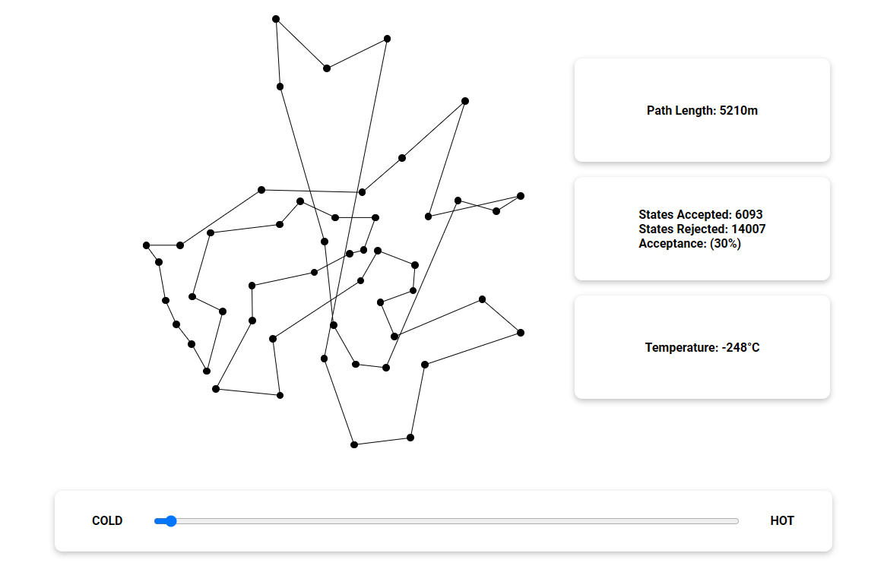
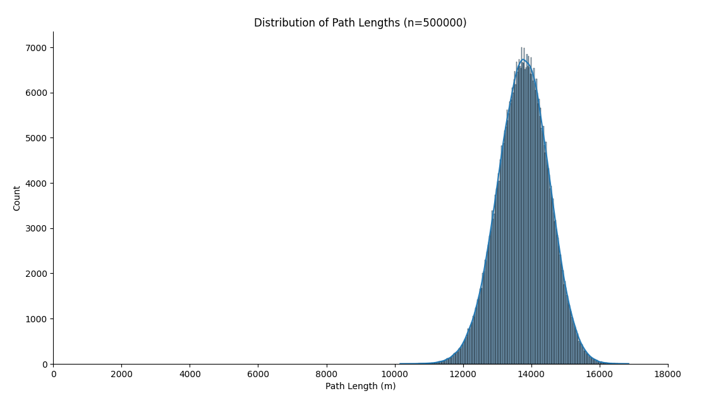

# Simulated Annealing

Simulated Annealing is a single-state method for combinatorial optimization.

Inspired by annealing in metallurgy, this metaheuristic strategy provides a dynamic temperature variable as a means of controlling the compromise between **exploration** and **exploitation** during the optimization process.

### Interactive Demo

While the cooling of the system is typically automated, you can try performing simulated annealing by hand using this [interactive demo](https://eeoooue.github.io/simulated-annealing/), which presents a typical _Travelling Salesman Problem_ for a map featuring 50 locations.

To emulate the annealing process, first 'heat up' the system by raising the temperature until it appears 'melted'.

Then, gradually 'cool' the system at a steady rate to hopefully arrive at a high quality solution.

### Possible Solutions

There are a staggering 608,281,864,034,267,560,872,252,163,321,295,376,887,552,831,379,210,240,000,000,000 possible solution states for the problem featured in this project.

**Monte Carlo Sampling** [has been used](./python/Monte-Carlo-Sampling.ipynb) to estimate the distribution of path lengths among these possible solutions.

